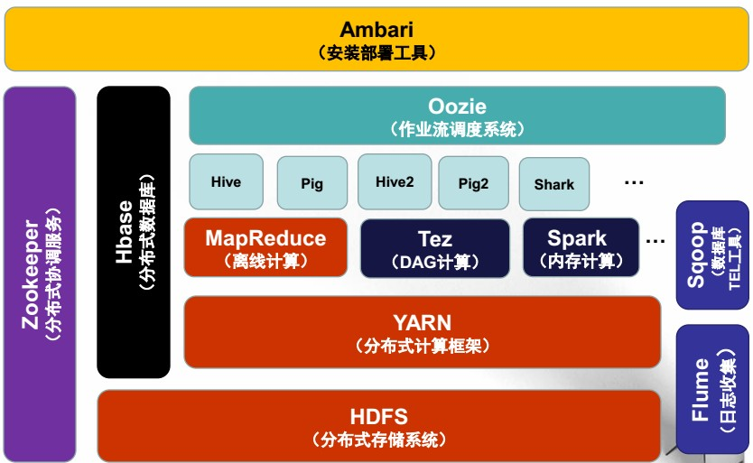
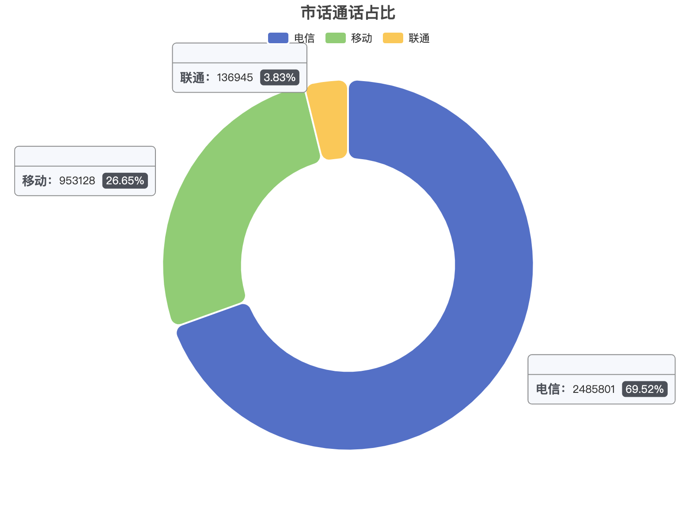
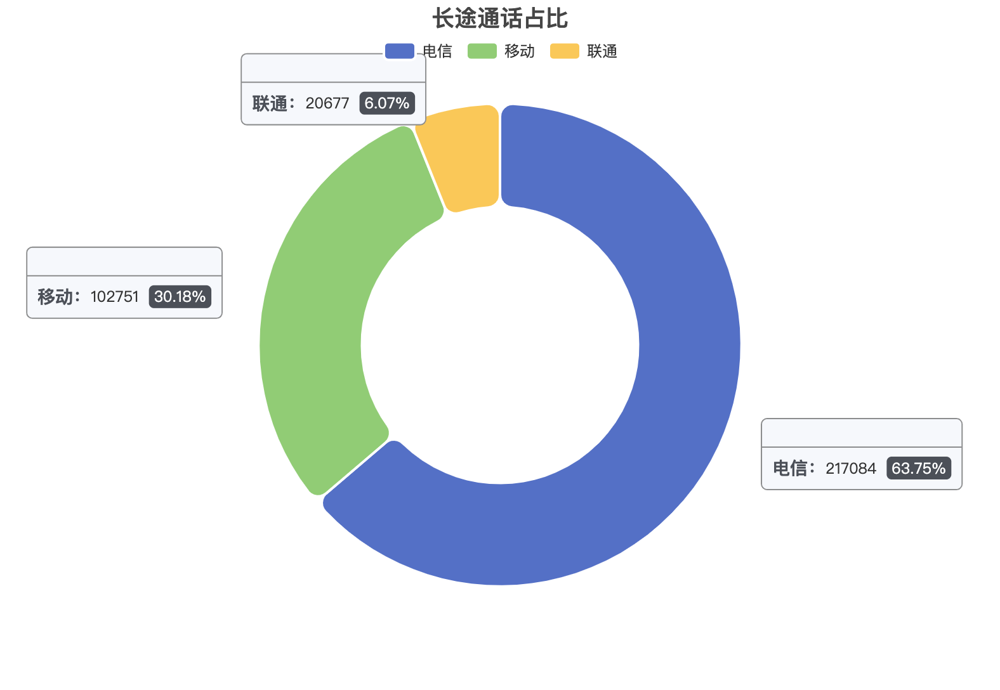
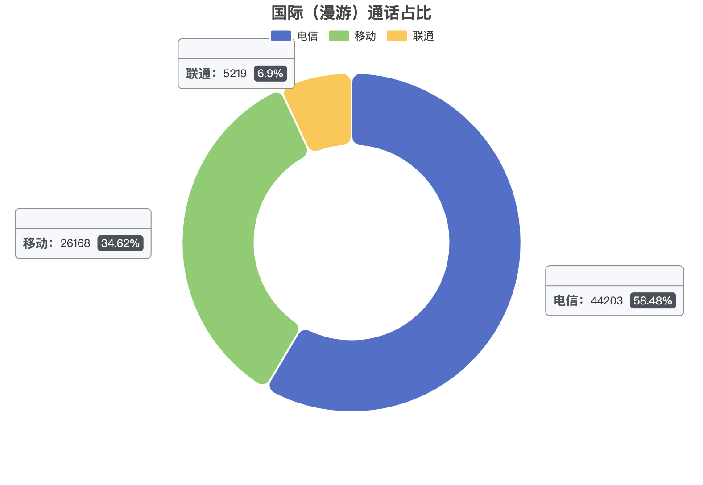

# 云计算课程项目报告

## 项目成员

**1950072 郑柯凡 1953981 吴昊天**

## 目录

+ ### [1 系统架构](#系统架构)

  + #### [1.1 系统组成](##系统组成)

  + #### [1.2 hadoop架构介绍](##hadoop架构)

+ ### [2 文件管理方法](#文件管理方法)

  + #### [2.1 HDFS介绍](##HDFS)

  + #### [2.2 文件分块方法](##文件分块方法)

  + #### [ 2.3 文件备份方法](##文件备份方法)

  + #### [2.4文件一致性方法](##文件一致性方法)

+ ###  [3 计算任务分配机制](#计算任务分配机制)

  + #### [3.1 MapReduce](#MapReduce)

+ ### [4 实现过程](#实现过程)

  + #### [4.1 搭建尝试](#搭建尝试)

  + #### [4.2 实际环境搭建](#实际环境搭建)

  + #### [4.3 程序编码调试](#程序编码调试)

  + #### [4.4 性能测试优化](#性能测试优化)


## 1 系统架构

### 1.1 系统组成

+ 4台CentOS Linux release 7.9.2009 (Core)虚拟机，主机名分别为Master、Slave1、Slave2和Slave3。
+ Master和Slave1部署在Windows 11操作系统上，Slave2和Slave3部署在MacOS操作系统上，组成了一个分布式的云计算系统。

|       Master       |     Slave1     |     Slave2     |     Slave3     |
| :----------------: | :------------: | :------------: | :------------: |
| IP：192.168.43.220 | 192.168.43.221 | 192.168.43.222 | 192.168.43.223 |
|      NameNode      |     —————      |     —————      |     —————      |
|       —————        |    DataNode    |    DataNode    |    DataNode    |

+ 虚拟机软件
  + VMware Fusion
  + VMware Workstation 15 Pro

+ 软件版本
  + hadoop 2.10.1
  + java-1.8.0-openjdk-devel.x86_64
  + hive 2.3.9
  + CentOS Linux release 7.9.2009

### 1.2 hadoop架构

#### 概念

- Apache Hadoop是一款支持数据密集型分布式应用并以Apache 2.0许可协议发布的开源软件框架。它支持在商品硬件构建的大型集群上运行的应用程序。Hadoop是根据Google公司发表的MapReduce和Google档案系统的论文自行实作而成。
- Hadoop是一套开源的软件平台，利用服务器集群，根据用户的自定义业务逻辑，对海量数据进行分布式处理。诞生于2006年。主要目标是对分布式环境下的“大数据”以一种可靠、高效、可伸缩的方式处理。
- Hadoop框架透明地为应用提供可靠性和数据移动。它实现了名为MapReduce的编程范式：应用程序被分割成许多小部分，而每个部分都能在集群中的任意节点上执行或重新执行。
- Hadoop还提供了分布式文件系统，用以存储所有计算节点的数据，这为整个集群带来了非常高的带宽。

#### 基本组成部分



## 2 文件管理方法

#### 2.1 HDFS

HDFS是一个分布式的文件存储系统，它起源于Apache Nutch项目

- 支持高容错，它可以部署在低成本的硬件上。
- 支持高吞吐量的访问，尤其当程序需要读取大的数据集合时
- 支持流式访问，因此并没有严格的遵守POSIX协议

一个HDFS实例包含了成千上万个服务器，他能够检测故障并快速的自动恢复；应用程序需要通过流式的方式，去访问它们在HDFS上的数据；HDFS应用程序的访问模型是，通常需要一次写入、多次读取。一个文件除了创建（created）、写入（written）、关闭（closed）之后，就不需要再进行修改了，除了追加（appends）和截断（truncates）之外；HDFS提供了接口，让应用程序在离它们需要的数据更近的地方，进行运行和计算。

##### NameNode职责：

- 执行文件系统命名空间的相关操作，如打开，关闭和重命名文件和目录。
- 决定数据块（blocks）到DataNode的映射。

##### DataNode职责：

- 在HDFS内部，一个文件会被分成一个或多个块，这些块存储在DataNode中。
- 负责提供来自文件系统客户端的读取和写入请求。
- 根据来自NameNode的指令，执行数据块创建，删除和复制操作。


#### 2.2 文件分块方法

hdfs将所有的文件全部抽象成为block块来进行存储，不管文件大小，全部一视同仁都是以block块的统一大小和形式进行存储，方便我们的分布式文件系统对文件的管理

所有的文件都是以block块的方式存放在HDFS文件系统当中，在Hadoop1当中，文件的block块默认大小是64M，Hadoop2当中，文件的block块大小默认是128M，block块的大小可以通过hdfs-site.xml当中的配置文件进行指定

在项目中使用的配置是分块大小是128M，这个大小是基于最佳传输损耗理论而来的，**最佳传输损耗理论**：在一次传输中，寻址时间占用总传输时间的1%时，本次传输的损耗最小，为最佳性价比传输。目前硬件的发展条件，普通磁盘写的速率大概为100M/S, 寻址时间一般为10ms。虽然现在的固态硬盘的读写速度远大于这个值，但受网络和虚拟机限制，没有修改默认的分块大小

**文件分块截图**：❌❌❌❌


#### 2.3 文件备份方法

- 集群中的名称节点（NameNode）会把文件系统的变化以追加保存到日志文件edits中。

- 当名称节点（NameNode）启动时，会从镜像文件 fsimage 中读取HDFS的状态，并且把edits文件中记录的操作应用到fsimage，也就是合并到fsimage中去。合并后更新fsimage的HDFS状态，创建一个新的edits文件来记录文件系统的变化

- Secondary NameNode定期合并fsimage和edits日志，把edits日志文件大小控制在一个限度下

- fs.checkpoint.period 指定两次checkpoint的最大时间间隔，默认3600秒

- #### 文件备份测试

  + ❌❌❌❌❌
  + ❌❌❌❌

#### 2.4 文件一致性方法

客户端上传文件时，NameNode首先往edits log文件中记录元数据的操作日志。与此同时，NameNode将会在磁盘做一份持久化处理（fsimage文件）

+ 在edits logs满之前对内存和fsimage的数据做同步
+ （实际上只需要合并edits logs和fsimage上的数据即可，然后edits logs上的数据即可清除）
+ 而当edits logs满之后，文件的上传不能中断，所以将会往一个新的文件edits.new上写数据，
+ 而老的edits logs的合并操作将由secondNameNode来完成，即所谓的checkpoint操作。

SecondaryNameNode工作过程：

+ secondary通知namenode切换edits文件
+ secondary从namenode获得fsimage和edits(通过http)
+ secondary将fsimage载入内存，然后开始合并edits
+ secondary将新的fsimage发回给namenode
+ namenode用新的fsimage替换旧的fsimage

**文件一致性测试**

+ ❌❌❌❌❌

## 3 计算任务分配机制

#### 3.1 MapReduce

1. JobTracker接收到Job对象对其submitJob()方法的调用后，就会把这个调用放入一个内部队列中，交由作业调度器(Job Scheduler)进行调度,并对其进行初始化。
2. **初始化工作**：创建一个表示正在运行作业的对象(它封装任务和记录信息，以便跟踪任务的状态和进程)
3. **创建任务运行列表**，包括map和reduce任务，创建任务过程分析
   + 作业调度器从HDFS中获取JobClient已计算好的输入分片信息，然后为每个分片创建一个map任务，并且创建Reduce任务
   + 除了map和reduce任务，还有setupJob和cleanupJob需要建立
4. **任务分配**
   + TaskTracker定期通过“心跳”与JobTracker进行通信，主要是告知JobTracker自身是否还存活，以及是否已经准备好运行新的任务等
   + JobTracker在为TaskTracker选择任务之前，必须先通过作业调度器选定任务所在的作业
   + 每个TaskTracker都有固定数量的map和reduce任务槽，数量取决于TaskTracker节点的CPU内核数量和内存大小
   + JobTracker分配map任务时会选取与输入分片最近的TaskTracker(任务本地化)。
5. **任务执行**
   + TaskTracker分配到一个任务后，通过从HDFS把作业的Jar文件复制到TaskTracker所在的文件系统（Jar本地化用来启动JVM），同时TaskTracker将应用程序所需要的全部文件从分布式缓存复制到本地磁盘
   + TaskTracker为任务新建一个本地工作目录，并把Jar文件中的内容解压到这个文件夹中
   + TaskTracker新建一个TaskRunner实例来启动一个新的JVM来运行每个Task(包括MapTask和ReduceTask)。子进程通过umbilical接口与父进程进行通信，Task的子进程每隔几秒便告知父进程它的进度，直到任务完成
6. **进度和状态更新过程**
   + Child JVM有独立的线程，每隔3秒检查一次任务更新标志，如有更新则报告给 TaskTracker,TaskTracker每隔5秒给JobTracker发一次心跳信息
   + 同时JobClient通过每秒查询JobTracker来获得最新状态，并且输出到控制台上
7. **作业完成**：当JobTracker收到作业最后一个任务已完成的通知后，便把作业的状态设置为"成功"

## 4 实现过程

#### 4.1 搭建尝试

+ 在项目初期，打算通过Docker在服务器配置hadoop环境，实现四台服务器上多节点的完全分布式集群。在完成基本配置后，启动hadoop或者运行mapreduce时，经常会出现服务器由于内存不足而宕机卡住的情况出现，导致不得不重启服务器和hadoop集群，但重启之后依然会出现上述情况。于是考虑通过开启虚拟内存的方式增加内存资源进行尝试，但依然无法解决机器宕机的情况，无法稳定进行测试和运算。参考的教程如下：[服务器开启虚拟内存](https://blog.csdn.net/qq_35500685/article/details/92787168?utm_medium=distribute.pc_aggpage_search_result.none-task-blog-2~aggregatepage~first_rank_ecpm_v1~rank_v31_ecpm-4-92787168.pc_agg_new_rank&utm_term=%E6%9C%8D%E5%8A%A1%E5%99%A8%E5%A6%82%E4%BD%95%E6%89%93%E5%BC%80%E8%99%9A%E6%8B%9F%E5%86%85%E5%AD%98&spm=1000.2123.3001.4430)

+ 以下是在服务器上只搭建了一个DataNode的情况，分别通过`hdfs dfsadmin -report`命令查看hadoop当前hadoop的运行状况，以及`free -m`命令查看服务器的资源占用情况，可以发现只启动了一个节点的情况下，服务器的内存资源就已经消耗殆尽，依靠虚拟内存才勉强维持运行，且使用的虚拟内存容量远大于剩余的物理内存容量。

  

  

#### 4.2 实际环境搭建

- 由于上述性能原因，我们放弃了在服务器上搭建hadoop集群的想法，选择在各自的笔记本电脑虚拟机软件上实现分布式的系统。使用的虚拟软件有VMware Fusion以及VMware Workstation 15 Pro。

+ 总体系统由4台CentOS Linux release 7.9.2009 (Core)虚拟机组成，主机名分别为Master、Slave1、Slave2和Slave3。Master和Slave1部署在Windows 11操作系统上，Slave2和Slave3部署在MacOS操作系统上。

|       Master       |     Slave1     |     Slave2     |     Slave3     |
| :----------------: | :------------: | :------------: | :------------: |
| IP：192.168.43.220 | 192.168.43.221 | 192.168.43.222 | 192.168.43.223 |
|      NameNode      |     —————      |     —————      |     —————      |
|       —————        |    DataNode    |    DataNode    |    DataNode    |

搭建方法参考老师提供的资料以及一些[网络资源。](http://dblab.xmu.edu.cn/blog/2775-2/#more-2775)

+ 在后期的执行测试阶段，发现会出现无法预测的错误产生，如下图所示

  

  经过在网络上多方查询，没有能够彻底解决问题，因此考虑到可能是虚拟机的性能问题。所以，我们尝试将Slave2、Slave3放置到性能更好的台式机上运行，继续进行测试。

  在网络配置完成后，继续执行同样的MapReduce程序，可以发现之前出现的错误均不会产生，可以正常的执行完成所有的过程

  

  

#### 4.3 程序编码调试

+ **数据预处理**

  ```python
  for line in f:
      tol += 1
      str_list = line.split()
      # 判断字段是否完全
      if len(str_list) != 14:
          delete_num += 1
          print(str_list)
          continue
      # 判断时间是否有效
      if int(str_list[11]) <= 0:
          delete_num += 1
          print(str_list)
          continue
      newf.write(line)
  ```

  在给出的数据中，有些数据存在错误，所以采用了一个简单的python脚本程序来过滤掉其中的一些错误数据：比如去掉其中字段不全的数据；去除通话时间小于等于零的数据等等。通过这些处理之后，可以有效防止执行mapreduce程序过程中的错误的产生。

+ **MapReduce编码**

  MapReduce总的有两部分的任务组成：Map和Reduce。Map任务是读取并处理一个数据块以生成键值对作为中间输出；Reduce任务的输入是是Mapper任务的输出，Reduce将这些中间数据元组聚合物成一组较小的元组或键值对，即最终的输出。

  下面是MapReduce的一个任务示例：计算文章中的单词出现个数

  

  + 计算任务一

    第一个任务要求统计用户的每日平均通话次数，并以键值对<主叫号码，平均每日通话次数>的格式输出保存。具体的计算思路就是在Map过程中遍历数据，对每次通话的主叫号码记录其通话次数为1。在Reduce阶段，对每个主叫号码的通话次数累加，得出其总通话次数，并除以总天数得到每日平均通话次数。虽然题目中要求的键值对以主叫号码作为key，但接电话也算通话，因此本题中对一通电话的主叫和被叫都进行了记录。

  + 计算任务二

    ```java
    // 使用通话类型加运营商类别作为key 使用硬编码值1作为value
    context.write(new Text(call_type + calling_optr), new IntWritable(1));
    context.write(new Text(call_type + calling_optr), new IntWritable(1));
    ```

    因为有打电话和接电话的区别，所以在Map这一步的时候，将call_type + calling_optr和call_type + calling_optr同时作为key，所以一共有9种key的类别，计算的结果如下：

    ```c++
    11	2485801		//市话+电信
    12	953128		//市话+移动
    13	136945		//市话+联通
    21	217084		//长途+电信
    22	102751		//长途+移动
    23	20677		//长途+联通
    31	44203		//漫游+电信
    32	26168		//漫游+移动
    33	5219		//漫游+联通
    ```

    
    
    
    
    

  + 计算任务三

    任务三要求计算每个用户在各时间段的通话时长所占比例。采用的算法是初始化一个通话时长数组，并维护一个剩余通话时间（初始化为通话时间）以及剩余边界时间（初始化为通话开始时间到最近的下一个时间段边界时间），之后不断进行循环判断剩余通话时间和剩余边界时间的大小，若剩余通话时间小于等于剩余边界时间，则说明通话在该阶段结束，在数组中该阶段元素上加上剩余通话时长并退出循环；若剩余通话时间大于剩余边界时间，则通话在该阶段未结束，为数组该阶段元素加上剩余边界时长，并更新剩余通话时间和剩余边界时间，直至前一种情况出现。

    因为之前已经对原始数据进行了预处理，不存在通话时长为0的记录，通话时长和通话开始时间都是有效的，因此结果有效。


#### 4.4 性能测试优化

- **默认配置测试**

  在Hadoop默认配置下（分块大小128M，副本数为3）运行测试3个计算用例，Hadoop输出如下图所示。可以看见3个用例都正常计算完成，其中任务一总共耗时145秒左右，任务二耗时120秒左右，任务三耗时163秒左右。

  

  

  

- **尝试优化**

从Hadoop配置角度，尝试修改部分参数观察程序运行的总时间。实验结果显示，减少副本数后三个任务的计算时间都有不同程度的增加，经过分析（个人见解不一定准确），认为这是由于数据文件与计算节点不一致所导致的。最初，每个文件的副本数为3，而我们的计算节点数也为3，意味着每个节点上都有数据副本，计算时无需文件传输；而副本数为1时，若数据文件与计算节点不一致，则在计算时还需要从其他节点获取数据，因此还包含文件传输的时间，若恰巧数据文件与计算任务在同一节点上，则不会发生明显变化。

减少块的大小后，任务一和任务二的总运行时间没有发生太大变化，而任务三的总运行时间增加。首先，在本项目中，原始的数据文件(149M)并没有很大，128M的分块和64M的分块只有一个块的区别；同时，由于节点数也只有3，特殊情况出现的概率也比较大(数据就在节点自身)，因此每次实验的随机性较大，运行时间可参考性不高。

综上，不同的配置参数确实对MapReduce程序的运行时间存在影响，不过由于实验环境和测试数据限制，运行时间的随机性较大，可参考性不高，更可靠的影响规律还需要更大规模的分布式集群以及更多测试来总结。

|        | block-size(128)&&replications(3) | block-size(128)&&replications(1) | block-size(64)&&replications(3) |
| ------ | -------------------------------- | -------------------------------- | ------------------------------- |
| 任务一 | 145374 ms                        | 156313 ms                        | 154075 ms                       |
| 任务二 | 120847 ms                        | 210904 ms                        | 128120 ms                       |
| 任务三 | 163065 ms                        | 371679 ms                        | 277492 ms                       |

**block-size(128)&&replications(1)**


**block-size(64)&&replications(3)**


